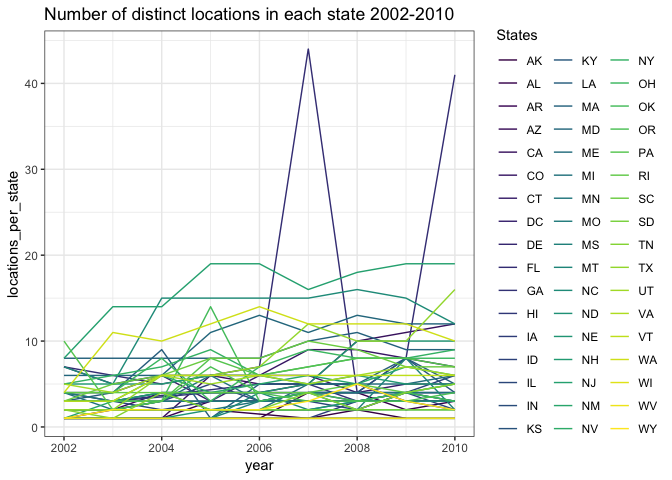
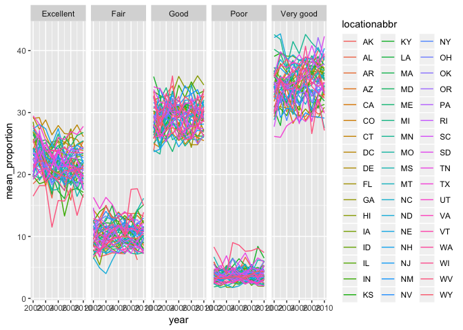
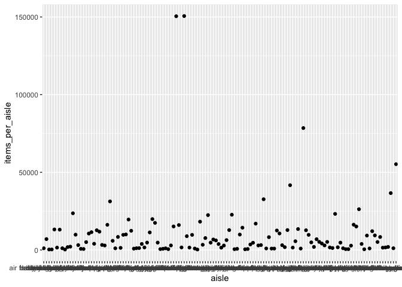
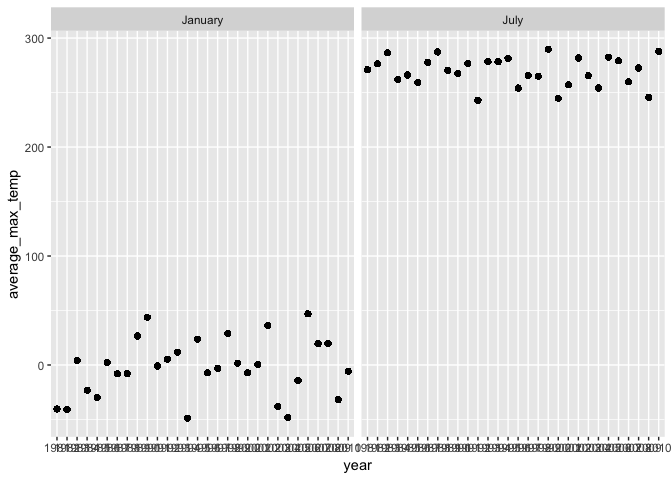
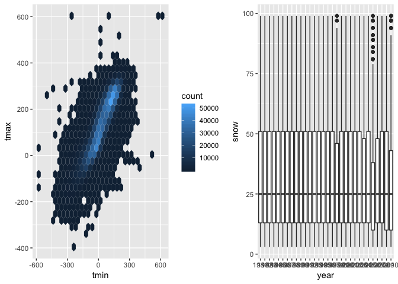

Homework 3
================
Jeanette Shekelle
10/15/2018

Loading libraries

``` r
library(tidyverse)
```

    ## ── Attaching packages ────────────────────────────────────────── tidyverse 1.2.1 ──

    ## ✔ ggplot2 3.0.0     ✔ purrr   0.2.5
    ## ✔ tibble  1.4.2     ✔ dplyr   0.7.6
    ## ✔ tidyr   0.8.1     ✔ stringr 1.3.1
    ## ✔ readr   1.1.1     ✔ forcats 0.3.0

    ## ── Conflicts ───────────────────────────────────────────── tidyverse_conflicts() ──
    ## ✖ dplyr::filter() masks stats::filter()
    ## ✖ dplyr::lag()    masks stats::lag()

``` r
library(p8105.datasets)
library(ggplot2)
```

Problem 1
---------

Data Import

``` r
data("brfss_smart2010")
```

Data Cleaning:

-   format the data to use appropriate variable names;
-   focus on the “Overall Health” topic
-   include only responses from “Excellent” to “Poor”
-   organize responses as a factor taking levels ordered from “Excellent” to “Poor”

``` r
brfss_smart2010 = 
  brfss_smart2010 %>% 
   janitor::clean_names() %>% 
  filter(topic == "Overall Health") %>% 
  filter(response == "Excellent" | response == "Very good" | response == "Good" | response == "Fair" | response == "Poor") %>% 
  mutate(response_level = forcats::fct_relevel(response, c("Excellent", "Very good", "Good", "Fair", "Poor")))
```

### Answering the questions

-   In 2002, which states were observed at 7 locations?

``` r
brfss_smart2010 %>% 
  filter(year == 2002) %>% 
  group_by(locationabbr) %>% 
  distinct(locationdesc) %>% 
  count() %>% 
  filter(n == 7)
```

    ## # A tibble: 3 x 2
    ## # Groups:   locationabbr [3]
    ##   locationabbr     n
    ##   <chr>        <int>
    ## 1 CT               7
    ## 2 FL               7
    ## 3 NC               7

There are 3 states that were observed at 7 locations: CT, FL, and NC.

-   Make a “spaghetti plot” that shows the number of locations in each state from 2002 to 2010.

``` r
brfss_smart2010 %>% 
  group_by(locationabbr, year) %>% 
  distinct(locationdesc) %>% 
  summarize(locations_per_state = n()) %>% 
  ggplot(aes(x = year, y = locations_per_state, color = locationabbr)) +
  geom_line() + theme_bw() + 
  viridis::scale_color_viridis(name = "States", discrete = TRUE) +
  labs (title = "Number of distinct locations in each state 2002-2010")
```



It is really hard to distinguish the plots of different states. Many colors look basically the same. I tried changing the color scale but it is still hard to tell. We need 50 colors that all look very different from one another and I am not sure that is possible. I don't think this is the best way to visualize this data because we can't tell what state had this huge spike in 2007 and 2010.

-   Make a table showing, for the years 2002, 2006, and 2010, the mean and standard deviation of the proportion of “Excellent” responses across locations in NY State.

``` r
brfss_smart2010 %>% 
  filter(year == 2002 | year == 2006 | year == 2010) %>% 
  filter(locationabbr == "NY") %>% 
  filter(response == "Excellent") %>% 
  group_by(year) %>% 
  summarise(mean_excellent = mean(data_value),
            sd_excellent = sd(data_value)) %>% 
  knitr::kable(digits = 2)
```

|  year|  mean\_excellent|  sd\_excellent|
|-----:|----------------:|--------------:|
|  2002|            24.04|           4.49|
|  2006|            22.53|           4.00|
|  2010|            22.70|           3.57|

The mean proportion of excellent responses only varies by 2% when looking at the years 2002, 2006, and 2010. It seems pretty consistent.

-   For each year and state, compute the average proportion in each response category (taking the average across locations in a state). Make a five-panel plot that shows, for each response category separately, the distribution of these state-level averages over time.

``` r
brfss_smart2010 %>% 
  group_by(year, locationabbr, response) %>% 
  summarize(mean_proportion = mean(data_value)) %>% 
  ggplot(aes(x = year, y = mean_proportion, color = locationabbr)) +
  geom_line() +
  facet_grid(~response)
```

    ## Warning: Removed 2 rows containing missing values (geom_path).



Again, it is nearly impossible to distinguish specific states because the colors look very similar to one another. The lowest response proportion is for "Poor" and the highest response proportion is for "Very Good". All states clustered around the same 5-10% range for each response proportion.

Problem 2
---------

The goal is to do some exploration of this dataset. To that end, write a short description of the dataset, noting the size and structure of the data, describing some key variables, and giving illstrative examples of observations. Then, do or answer the following (commenting on the results of each):

``` r
library(p8105.datasets)
data("instacart") 
```

The instacart dataset has 15 variables and 1,384,617 observations. The key variables are the product name, aisle, and department because they tell us about the product. Other key variables are the the day of the week the product was ordered and the time of day. This information could be useful for planning product sales.

### Some questions

How many aisles are there, and which aisles are the most items ordered from?

``` r
instacart %>% 
  distinct(aisle_id) %>% 
  nrow()
```

    ## [1] 134

There are 134 aisles.

``` r
instacart %>% 
  group_by(aisle) %>% 
  count() %>% 
  arrange(desc(n))
```

    ## # A tibble: 134 x 2
    ## # Groups:   aisle [134]
    ##    aisle                              n
    ##    <chr>                          <int>
    ##  1 fresh vegetables              150609
    ##  2 fresh fruits                  150473
    ##  3 packaged vegetables fruits     78493
    ##  4 yogurt                         55240
    ##  5 packaged cheese                41699
    ##  6 water seltzer sparkling water  36617
    ##  7 milk                           32644
    ##  8 chips pretzels                 31269
    ##  9 soy lactosefree                26240
    ## 10 bread                          23635
    ## # ... with 124 more rows

The most items are ordered from the following aisles: fresh vegetables, fresh fruits, packaged vegatables fruits, yogurt, and packaged cheese. This makes sense because these are all very general aisles that encompass many products.

Make a plot that shows the number of items ordered in each aisle. Order aisles sensibly, and organize your plot so others can read it.

``` r
instacart %>% 
  group_by(aisle) %>%
  summarize(items_per_aisle = n()) %>% 
  ggplot(aes(x = aisle, y = items_per_aisle)) +
  geom_point()
```



Since there are 134 aisles, this is way too many to be able to read along the x-axis. There are two aisles that have way more items ordered than any other aisle. Both have 150,000 things orderd from them. Based on the answer to the previous question, I know this is the fresh vegetables and fresh fruits aisles.

Make a table showing the most popular item in each of the aisles “baking ingredients”, “dog food care”, and “packaged vegetables fruits”.

``` r
instacart %>% 
  filter(aisle %in% c("baking ingredients", "dog food care", "packaged vegetables fruits")) %>% 
  group_by(aisle) %>% 
  count(product_name) %>% 
  filter(min_rank(desc(n)) < 2) %>% 
  knitr::kable()
```

| aisle                      | product\_name                                 |     n|
|:---------------------------|:----------------------------------------------|-----:|
| baking ingredients         | Light Brown Sugar                             |   499|
| dog food care              | Snack Sticks Chicken & Rice Recipe Dog Treats |    30|
| packaged vegetables fruits | Organic Baby Spinach                          |  9784|

It is interesting to look at the number of items here. Even though Snack Sticks Chicken is the most popular item from dog food care aisle, there are only 30 ordered. This is tiny compared to the 9,784 bags of organic baby spinach ordered.

Make a table showing the mean hour of the day at which Pink Lady Apples and Coffee Ice Cream are ordered on each day of the week; format this table for human readers (i.e. produce a 2 x 7 table).

``` r
instacart %>% 
  filter(product_name == "Pink Lady Apples" | product_name == "Coffee Ice Cream") %>% 
  group_by(product_name, order_dow) %>% 
  summarise(mean_hour = mean(order_hour_of_day)) %>% 
  spread(key = order_dow, value = mean_hour)
```

    ## # A tibble: 2 x 8
    ## # Groups:   product_name [2]
    ##   product_name       `0`   `1`   `2`   `3`   `4`   `5`   `6`
    ##   <chr>            <dbl> <dbl> <dbl> <dbl> <dbl> <dbl> <dbl>
    ## 1 Coffee Ice Cream  13.8  14.3  15.4  15.3  15.2  12.3  13.8
    ## 2 Pink Lady Apples  13.4  11.4  11.7  14.2  11.6  12.8  11.9

The mean hour of the day that these two products are ordered at varies by a couple of hours. Coffee ice cream is typically ordered between 12pm and 3pm. Pink Lady Apples are ordered between 11am and 2pm.

Problem 3
---------

``` r
library(p8105.datasets)
data("ny_noaa")
```

The goal is to do some exploration of this dataset. To that end, write a short description of the dataset, noting the size and structure of the data, describing some key variables, and indicating the extent to which missing data is an issue. Then, do or answer the following (commenting on the results of each):

There are 2,595,176 observations in this dataset with each observation being a weather station ID. There are 7 columns. They are all key variables. They tell us the date of the measurement, the precipitation, snowfall, snow depth, and min and max temp. These are all important variables for tracking weather patterns and climate change. Missing data is definitely an issue. Some stations don't have information on all the variables.

Do some data cleaning. Create separate variables for year, month, and day. Ensure observations for temperature, precipitation, and snowfall are given in reasonable units. For snowfall, what are the most commonly observed values? Why?

``` r
ny_noaa_clean = 
ny_noaa %>% 
  janitor::clean_names() %>% 
  separate(date, into = c("year", "month", "day"), sep = "-") %>% 
  mutate(month = month.name[as.numeric(month)],
         tmin = as.numeric(tmin, na.rm = TRUE), 
         tmax = as.numeric(tmax, na.rm = TRUE))
```

For snowfall, what are the most commonly observed values? Why?

``` r
ny_noaa_clean %>% 
  group_by(snow) %>% 
  count(snow) %>% 
  summarise(most_common_snow = max(n, na.rm = TRUE)) %>% 
  arrange(desc(most_common_snow)) %>% 
  top_n(1)
```

    ## Selecting by most_common_snow

    ## # A tibble: 1 x 2
    ##    snow most_common_snow
    ##   <int>            <dbl>
    ## 1     0          2008508

The most common observed value is 0. This is what I expected because it only snows for a few months a year, so most of the time the weather station is getting no snow.

-   Make a two-panel plot showing the average max temperature in January and in July in each station across years. Is there any observable / interpretable structure? Any outliers?

``` r
ny_noaa_clean %>%
  filter(month == "January" | month == "July") %>% 
  group_by(year, month) %>% 
  mutate(average_max_temp = mean(tmax, na.rm = TRUE)) %>% 
  ggplot(aes(x = year, y = average_max_temp)) +
  geom_point() +
  facet_grid(~month)
```



The average max temp is way higher in July than in January. This is as expected. There were 3 extra cold outliers in July, 4 cold outliers in January, and 3 hot outliers in January.

-   Make a two-panel plot showing (i) tmax vs tmin for the full dataset (note that a scatterplot may not be the best option); and (ii) make a plot showing the distribution of snowfall values greater than 0 and less than 100 separately by year.

``` r
library(patchwork)
library(hexbin)
```

``` r
ny_noaa_min_max = 
ny_noaa_clean %>% 
  ggplot(aes(x = tmin, y = tmax)) +
  geom_hex()
```

``` r
ny_noaa_snow = 
ny_noaa_clean %>% 
  filter(snow > 0 & snow < 100) %>% 
  group_by(year) %>% 
  ggplot(aes(x = year, y = snow)) +
  geom_boxplot()
```

``` r
ny_noaa_min_max + ny_noaa_snow
```

    ## Warning: Removed 1136276 rows containing non-finite values (stat_binhex).



We can see areas with a higher t-min have a higher t-max. There is a linear relationship. For the snowfall plot, there is little variation in the 1980s and 1990s. Once it is in the 2000s, there is a lot of variation, perhaps due to global warming. There are a few years with several outliers that had much higher snowfall, but overall it doesn't vary much year to year.
